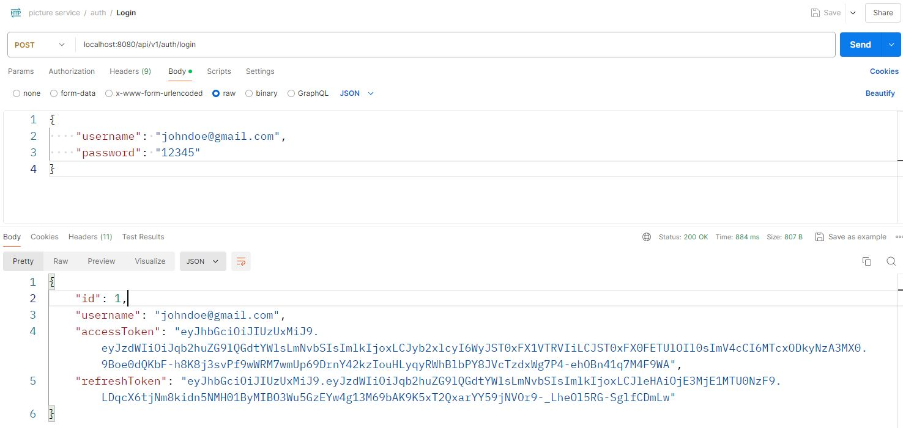
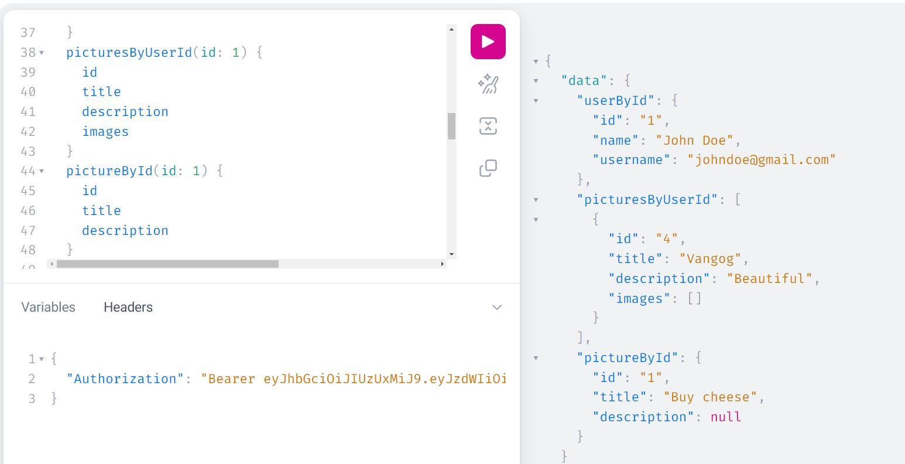
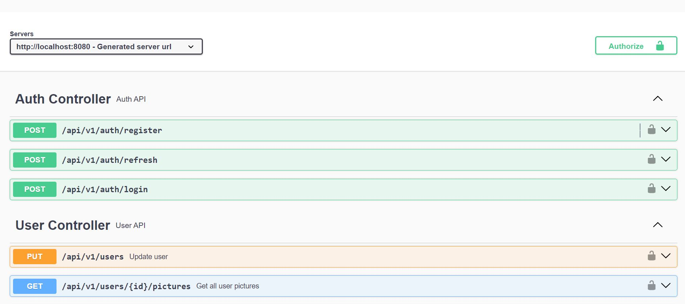
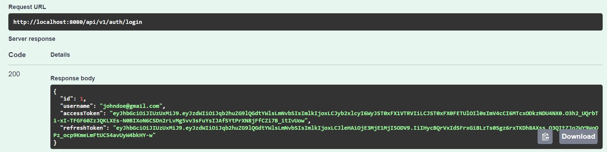
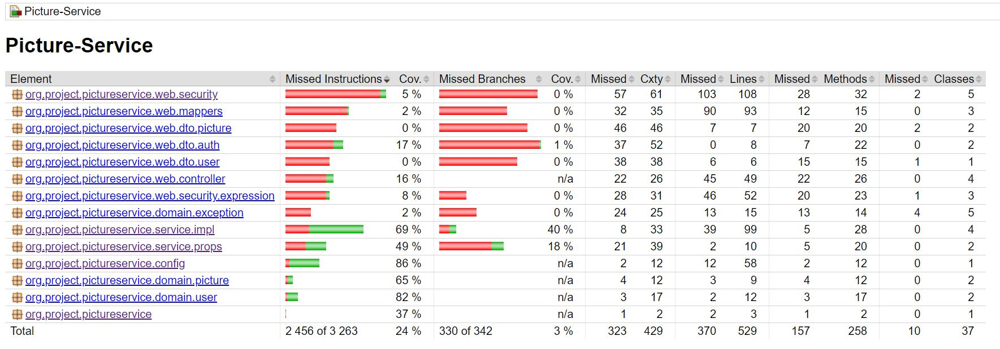

# Picture service

Login:

Example:

## Swagger example

Noauth

Login

Authenticated

## Tests

Тестировался service.impl, потому что в нём основная логика взаимодействия с репозиторием.
Контроллер просто к нему обращается

